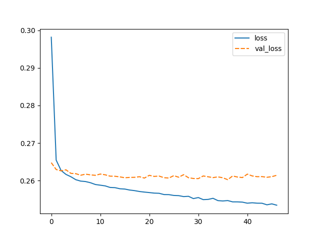
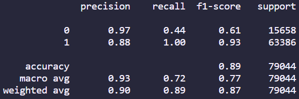

# Neural Networks: Predict Loan Payback

## Description

In this project I used neural networks to predict whether an individual would fully pay back or charge off their loan. The focus of this project was on learning how to preprocess extremely messy data as well as learning how to use tensorflow. The technologies used were:

- python 
- tensorflow
- scikit-learn
- pandas
- numpy
- seaborn
- matplotlib

My biggest challenged faced was preprocessing the messy data. Never before have I worked with a dataset where I had to check each feature one by one and go as indepth as I did in this project. I believe I did throughly clean the dataset and also identified many areas where I could improve the data say by removing outliers, but it was time consuming.

Furthermore, although this is separate to this project, I also learnt the importance of doing intentional commits with good descriptions and planned at times after changes that work and I need to clearly communicate to the viewer. An example of where a good use case would be is through committing after I make improvements to a model so viewers will be able to see what my model looked like before I changed it. I also realised that I should stop commiting changes to all files simultaneously and rather file by file. Hence, making meaningful commits is something I will try to improve on as I continue with my coding journey.

## Installation

To install this project you will have to download the repository from github and runit locally from your CLI. To be able to use this project python will have to be installed, which can be found [here](https://www.python.org/downloads/).

## Usage

Once installed you can use this project by entering the repository location using your CLI. Once entered into the repository you can run the project by entering the following in the CLI:

1. Creating a virtual environment [OPTIONAL]: ```python -m venv .venv```
2. Activating the virtual environment [OPTIONAL]: ```source .venv/Scripts/activate```
3. Downloading all the required packages: ```pip install -r requirements.txt```
4. Running the file: ```python main.py```

Once run graphs, numbers from the dataset and classification metrics will show similar to below:


